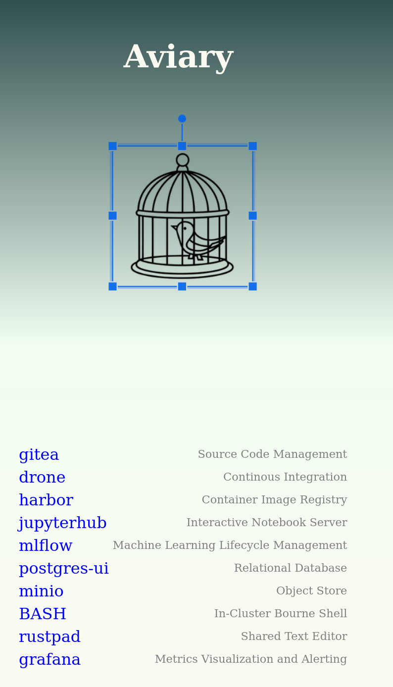

aviary-deploy
=============

IaC code to stand up a basic dev environment on a k8s cluster and an nfs server.  wip.

The Aviary Platform gives engineering teams access to a suite of tools running in a compliant Kubernetes cluster.  Included are tools to store data, build software, and develop machine learning models.  The tools are exposed via ingress with internal ca signed certs.

Installing
==========

- git clone
- cd aviary-deploy
- edit to taste
- tofu init
- tofu apply
- set up gitea app for drone
- tofu apply again with the app keys
- add the following to your /etc/hosts file
```
10.23.99.7      ssh.gitea.local ssh.gitea
10.23.99.4      ing cloudbeaver.local postgres-ui.local grafana.local kibana.local ing.local kubeshark.local tempo.local wiki.local gitea.local gitea cloudtty.local bash.local shell.local kubernetes-dashboard.local dashboard.local minio.local minio-hl.local prometheus.local velero.local drone.local harbor.local harbor jupyterhub.local jupyterhub mlflow.local rustpad.local jitsi.local rocketchat.local
```
Notes
=====

Take care to preserve your PVCs when re-deploying.  

tofu destroy skips helm installs that are in progress.  Take a look at `helm ls -A` and also check for sa, secret, and cm resources in the associated namespaces before reapplying.

Current runs against Ubuntu / kubeadm cluster running under kvm and metallb seem good.

