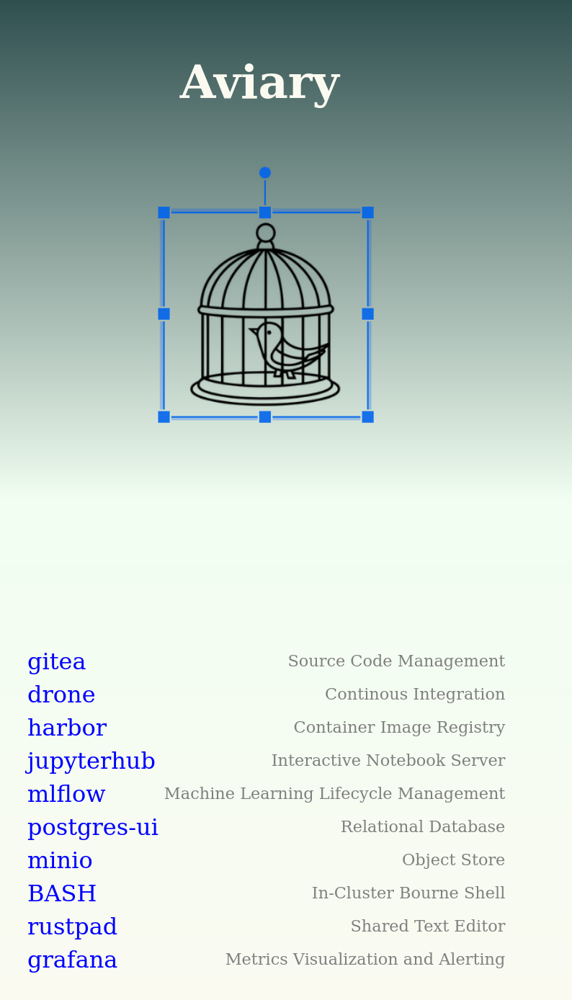

aviary-deploy
=============

IaC to stand up a basic dev environment on a Kubernetes cluster backed by an NFS server. wip.

The Aviary Platform gives engineering teams access to a suite of tools running in a Kubernetes cluster. Included are tools to store data, build software, and develop machine learning models. The tools are exposed through a shared Envoy Gateway (Kubernetes Gateway API) with internal CA-signed certs.

Layout
======

Terraform/OpenTofu configuration is grouped by role:

- `apps/` — user-facing applications
  - `argo` — Argo CD (`argo.local`)
  - `aviary-frontend` — platform landing page (`aviary.local`)
  - `bash` — CloudTTY in-browser shell (`bash.local`)
  - `drone` — Drone CI (`drone.local`)
  - `rustpad` — collaborative text editor (`rustpad.local`)
- `system/` — cluster services
  - `envoy-gateway` — Gateway API ingress; the shared `aviary` Gateway that fronts every app
  - `headlamp` — cluster UI (`headlamp.local`)
  - `grafana` — dashboards (`grafana.local`)
  - `harbor` — container registry (`harbor.local`)
  - `velero` — backup/restore (`velero.local`)
- `data/` — stateful services
  - `gitea` — self-hosted git (`gitea.local`, ssh via `ssh.gitea.local`)
  - `postgres` — Percona and Zalando Postgres operators, plus the Zalando UI (`postgres-ui.local`)
  - `qdrant` — vector database (`qdrant.local`)
- `disabled/` — modules that are not currently applied (`jitsi`, `jupyterhub`, `minio`, `mlflow`). Move a file up into `apps/`, `system/`, or `data/` to enable it.

Root files hold shared config: `variables.tf`, `terraform.tfvars`, `providers.tf`, `versions.tf`, `locals.tf`, and the `Makefile`.

Requires the `helm`, `kubernetes`, `gavinbunney/kubectl`, and `aminueza/minio` providers (see `versions.tf`).

Ingress uses the **Kubernetes Gateway API**. `system/envoy-gateway.tf` installs Envoy Gateway, defines a single shared `aviary` Gateway, and generates one HTTPS listener + one `HTTPRoute` per app from the `local.vhosts` table. TLS terminates at the Gateway: each listener references an `<app>-tls` secret provisioned by cert-manager, so **cert-manager must run with Gateway API support enabled** (`config.enableGatewayAPI=true`, i.e. `--feature-gates=ExperimentalGatewayAPISupport=true`). To expose a new app, add an entry to `local.vhosts` rather than writing an `Ingress`.

Quickstart
==========

Prerequisites:

- [OpenTofu](https://opentofu.org/) (`tofu`) or Terraform installed
- A reachable Kubernetes cluster and a kubeconfig for it
- `kubectl` and `helm` on your PATH (handy for troubleshooting)

Apply the configuration:

```sh
# 1. Clone and enter the repo
git clone <repo-url> aviary-deploy
cd aviary-deploy

# 2. Configure your deployment.
#    Edit terraform.tfvars — at minimum set `kubeconfig` to the path of your
#    cluster's kubeconfig, along with the IPs, hostnames, and passwords you want.
$EDITOR terraform.tfvars

# 3. Download providers and initialize the working directory
tofu init

# 4. Preview the changes (optional but recommended)
tofu plan

# 5. Apply
tofu apply
```

Gitea/Drone is a two-phase install: run `tofu apply` once, set up the Gitea
OAuth app for Drone, then run `tofu apply` again with the app keys.

Finally, point the ingress hostnames at your cluster by adding entries to
`/etc/hosts` (see the `Installing` section below for a sample).

To tear the environment down: `tofu destroy` (read the Notes below first).

Installing
==========

1. `git clone` this repo and `cd aviary-deploy`
2. Point `kubeconfig` in `terraform.tfvars` at your cluster
3. Edit `terraform.tfvars` to taste (passwords, hostnames, LB IP pool, NFS server/share)
4. `make init`
5. `make plan` then `make apply` (or `make apply-auto` to plan and apply in one shot)
6. Set up a Gitea OAuth app for Drone (and Argo), drop the client id/secret into the Drone config, and re-apply
7. Add the ingress hostnames to your `/etc/hosts` (see below)

The `Makefile` wraps the common `tofu` invocations:

```
make init          # tofu init
make validate      # tofu validate
make fmt           # tofu fmt -recursive
make plan          # plan to ./tfplan using terraform.tfvars
make apply         # apply the saved ./tfplan
make apply-auto    # plan + apply with -auto-approve
make destroy       # tofu destroy
make refresh       # tofu refresh
make output        # tofu output
make console       # tofu console
make target T=module.gitea            # plan a single target
make plan-with V=main-rustpad.tfvars  # plan with an alternate var-file
make apply-with V=main-rustpad.tfvars # apply with an alternate var-file
```

Sub-stacks
==========

Each role folder (`apps/`, `system/`, `data/`) is an independent OpenTofu stack
with its own state. The shared root files (`providers.tf`, `versions.tf`,
`variables.tf`, `locals.tf`, `terraform.tfvars`) are symlinked into each folder,
and each folder has its own `Makefile` mirroring the root targets.

Drive a sub-stack from the root Makefile (defaults to `apply-auto`; pick another
target with `CMD=`):

```
make data                 # apply the data/ stack
make apps CMD=plan        # plan the apps/ stack
make system CMD=destroy   # destroy the system/ stack
```

Or run `make` directly inside a folder (e.g. `cd system && make plan`).

Apply order matters: **`data` -> `apps` -> `system`**. The `system` stack's
`HTTPRoute`s are created in the app namespaces, and the gitea/drone
`ExternalName` aliases point at the shared gateway, so the backing apps and the
gateway should exist first. Because the stacks have separate state, this
ordering is not enforced by OpenTofu -- it is up to you.

/etc/hosts
==========

Point the web hostnames at the Envoy Gateway LoadBalancer IP (the `aviary` Gateway's address), and `ssh.gitea.local` at the Gitea SSH LoadBalancer IP (`ssh_load_balancer_ip` in `terraform.tfvars`). The IPs come from your MetalLB/Cilium address pool (`cilium_ip_address_pool`).

```
<gateway-lb-ip>   aviary.local argo.local bash.local drone.local grafana.local harbor.local harbor headlamp.local qdrant.local rustpad.local velero.local postgres-ui.local gitea.local gitea
<gitea-ssh-lb-ip> ssh.gitea.local ssh.gitea
```

Notes
=====

Take care to preserve your PVCs when re-deploying.

`tofu destroy` skips helm installs that are in progress. Take a look at `helm ls -A` and also check for `sa`, `secret`, and `cm` resources in the associated namespaces before reapplying.

Current runs against an Ubuntu / kubeadm cluster running under KVM with MetalLB seem good.


